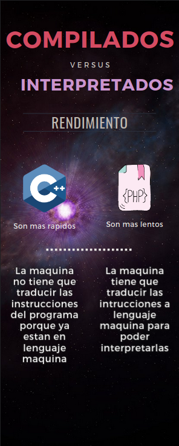
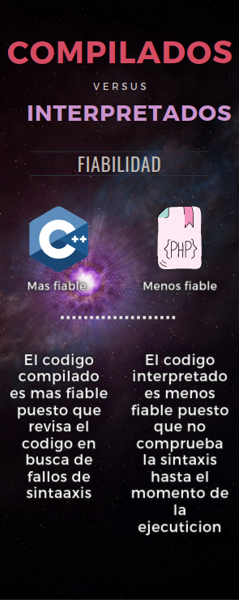
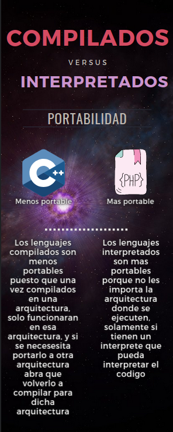

# Entornos de Desarrollo
## UT01: Introducción al desarrollo de Software Compiladores, intérpretes y transpiladores
### Objetivos
-  Ampliar los conocimientos sobre diferentes tecnologías de generación de código
### Elementos necesarios
- Ordenador con acceso a Internet
- LibreOffice Writer
### Instrucciones
Esta actividad se hará de forma individual. Responde sobre el propio documento.
Tiempo estimado: 1-2 sesiones
### Actividad 1: Comparando lenguajes compilados, virtuales e interpretados
1. Diseña una infografía que compare lenguaje compilados con lenguajes interpretados desde varios puntos de vista: el rendimiento, la fiabilidad de detección de errores, la flexibilidad del lenguaje y la portabilidad.

2. Hemos hecho un programa con un lenguaje interpretado y lo queremos distribuir. ¿Que necesitará un usuario que quiera ejecutar nuestro programa en su ordenador? Argumenta la respuesta.
3. Tu programa está compuesto por dos ficheros de código fuente A y B. Ejecutas el programa y mientras está ejecutando instrucciones del fichero de código fuente A ves que hay un error de programación en el fichero B y modificas ese fichero. Compara cómo harías para que se ejecute el programa con el cambio que acabas de hacer en un compilador o en un intérprete.

Actividad 2: Compiladores, intérpretes y...transpiladores
Investiga y responde a las siguientes preguntas:
1. ¿Qué es un transpilador?2. ¿Cuál es la principal diferencia de un transpilador con un compilador?
3. Cita ejemplos de lenguajes actuales que usen un transpilador.
